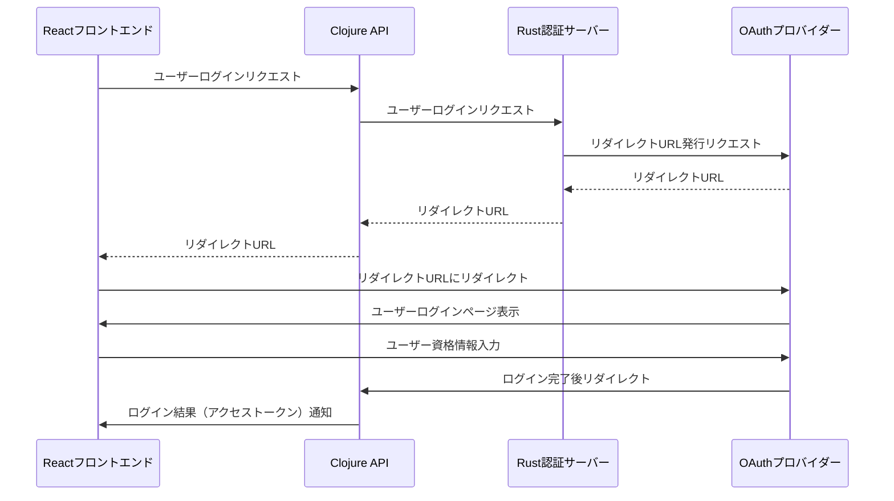

```mermaid
sequenceDiagram
participant React as Reactフロントエンド
participant Clojure as Clojure API
participant Rust as Rust認証サーバー
participant OAuth as OAuthプロバイダー

React->>Clojure: ユーザーログインリクエスト
Clojure->>Rust: ユーザーログインリクエスト
Rust->>OAuth: リダイレクトURL発行リクエスト
OAuth-->>Rust: リダイレクトURL
Rust-->>Clojure: リダイレクトURL
Clojure-->>React: リダイレクトURL
React->>OAuth: リダイレクトURLにリダイレクト
OAuth->>React: ユーザーログインページ表示
React->>OAuth: ユーザー資格情報入力
OAuth->>Clojure: ログイン完了後リダイレクト
Clojure->>React: ログイン結果（アクセストークン）通知
```
