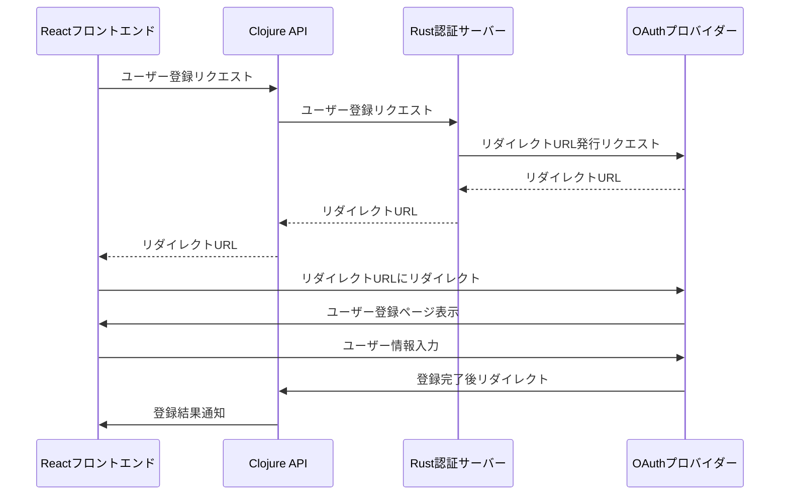

```mermaid
sequenceDiagram
participant React as Reactフロントエンド
participant Clojure as Clojure API
participant Rust as Rust認証サーバー
participant OAuth as OAuthプロバイダー

React->>Clojure: ユーザー登録リクエスト
Clojure->>Rust: ユーザー登録リクエスト
Rust->>OAuth: リダイレクトURL発行リクエスト
OAuth-->>Rust: リダイレクトURL
Rust-->>Clojure: リダイレクトURL
Clojure-->>React: リダイレクトURL
React->>OAuth: リダイレクトURLにリダイレクト
OAuth->>React: ユーザー登録ページ表示
React->>OAuth: ユーザー情報入力
OAuth->>Clojure: 登録完了後リダイレクト
Clojure->>React: 登録結果通知

```